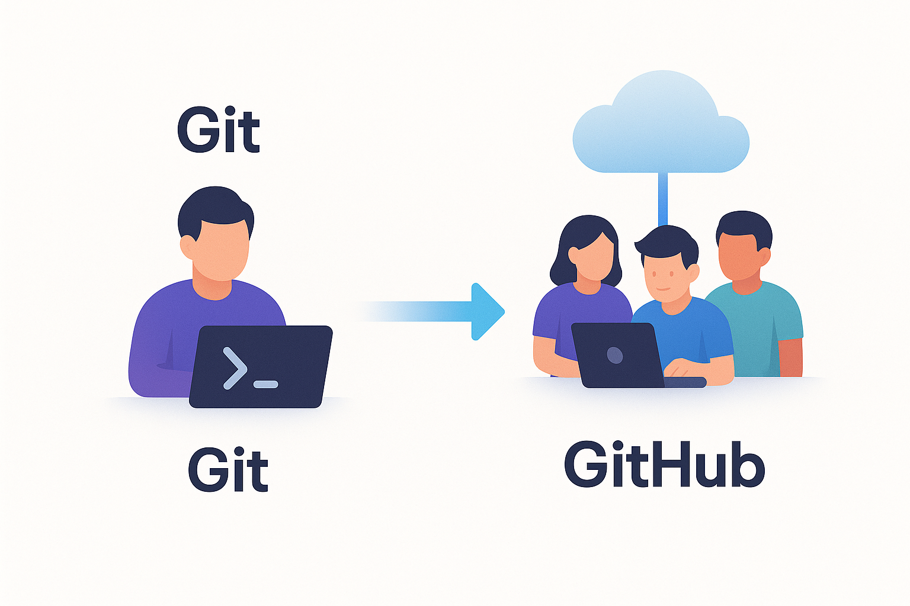
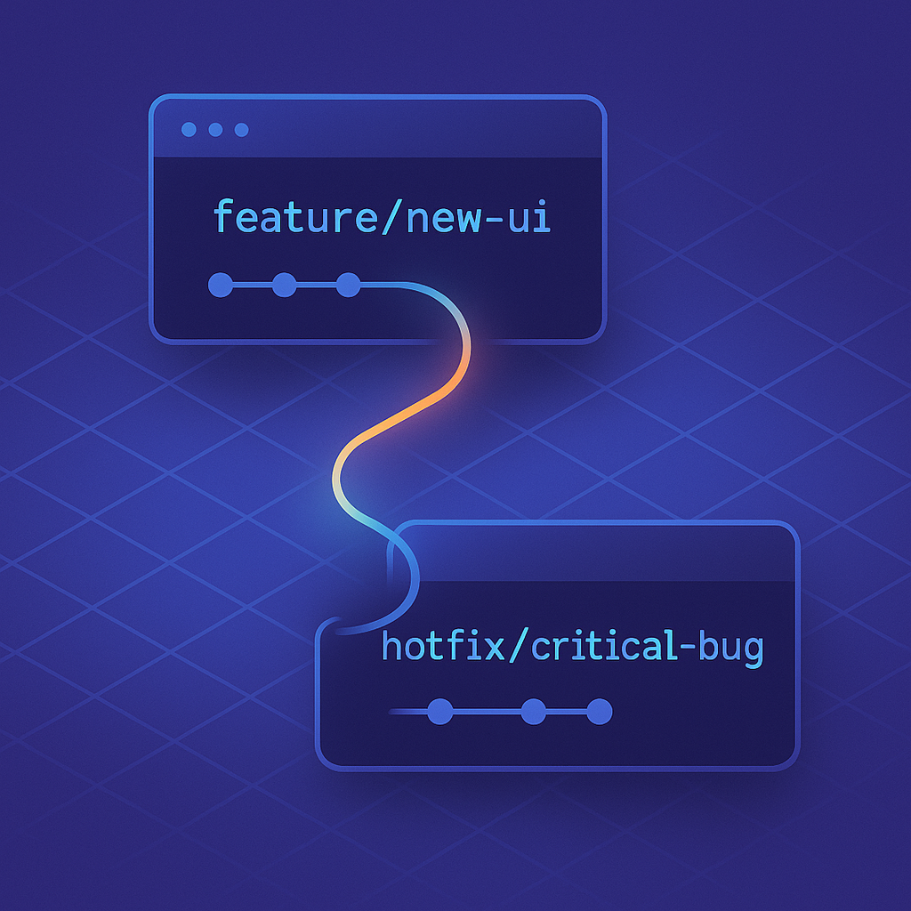
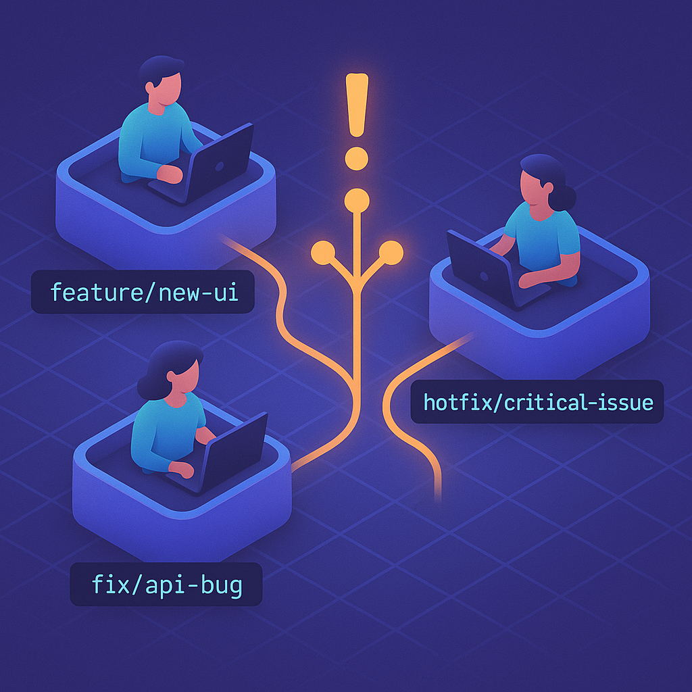
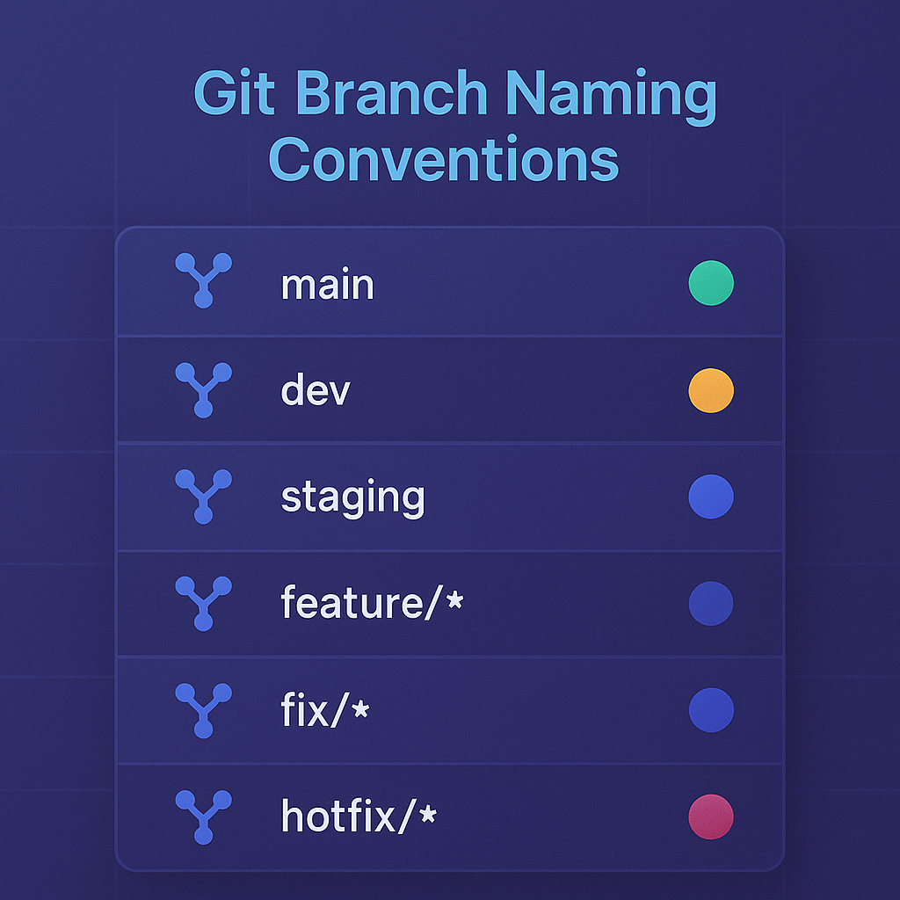

# 🧭 The Developer’s Time Machine — Why Version Control Matters


### *Understanding Git, GitHub, and the Power of Branches*

In software development, **chaos isn’t the exception — it’s the default.**
Multiple developers, evolving features, urgent bug fixes, and those infamous last-minute “just one more change” moments — all colliding in one codebase. Without a system to manage that chaos, every project eventually breaks under its own weight.

That’s where **version control** steps in.
It’s not just a tool; it’s the **foundation of modern engineering discipline.**

---

## 🔍 Git vs GitHub — The Core Difference



Let’s clear up a common confusion first:

* **Git** is a **version control system** — a command-line tool that helps you track, navigate, and manage changes in your codebase locally.
* **GitHub** is a **collaboration platform** built on top of Git — it adds cloud-based repositories, pull requests, reviews, and role-based access, making teamwork seamless.

Think of it like this:
👉 Git is your **brain** — it remembers everything.
👉 GitHub is your **meeting room** — it lets everyone discuss, share, and approve work together.

Without Git, GitHub wouldn’t exist. But without GitHub, Git would feel lonely.

---

## 🧩 Why Version Control Is Non-Negotiable

When working on any non-trivial project, you constantly juggle ideas, experiments, and revisions. Some succeed. Others fail. That’s part of the creative process.

But without version control, you risk:

* Losing stable builds after every “quick fix.”
* Having no clear context for *what changed and why.*
* Accidentally overwriting your teammate’s work.

With Git, however, you can:

* **Track** every change precisely.
* **Branch** off safely to test new ideas.
* **Merge** structured contributions.
* **Revert** bad decisions without panic.

Git keeps your progress **modular, reversible, and auditable** — empowering teams (and even solo devs) to move fast without breaking everything.


---

## 🧠 The Real-World Chaos Git Helps Manage

A developer’s workflow is rarely linear.
You might be building Feature A when a high-priority bug demands attention. Or maybe you’re mid-task when inspiration strikes for a better approach.

Without Git, this means messy folder copies or overwritten files.
With Git, it’s as simple as:

```bash
git checkout -b hotfix/critical-bug
# fix the issue, commit it
git checkout feature/new-ui
# continue where you left off
```



Git enables **context switching without collateral damage** — freedom with safety nets.

---

## 🌿 Branching Strategies — Managing Ideas, Features, and Environments

A **branch** isn’t just a copy of your code — it’s a *sandbox for ideas.*

Every new feature, fix, or experiment can live in its own branch until it’s ready to merge.
This structure allows creativity without chaos.



---

### 🌱 The Philosophy of Branches

Even in solo projects, branches matter.
If you’ve ever been halfway through a change and needed to pause for something else, you know the dilemma:

* Should you commit incomplete work?
* Or risk losing it?

A branch solves this instantly.
You can save partial progress, switch to another task, and return later — with everything preserved.

It’s the difference between *“I broke my build”* and *“I’ll get back to this later.”*

---

### ⚙️ Common Branching Scenarios

Here’s where branches really shine:

1. **Experimentation** — exploring two ideas at once (`feature/idea-A` vs `feature/idea-B`)
2. **Task Switching** — moving between features and urgent hotfixes
3. **Abandoning an Approach** — starting clean while keeping references
4. **Collaboration** — multiple developers working on isolated branches

Branches turn what used to be chaos into parallel progress.

---

### 🪴 Naming Conventions and Default Branches

Clarity saves time.
Use consistent naming patterns like:

* `main` or `master` → stable, production-ready
* `dev` → active development
* `staging` → pre-production environment
* `feature/*` → new features (e.g., `feature/payment-gateway`)
* `fix/*` → bug fixes (e.g., `fix/login-redirect`)
* `hotfix/*` → urgent production issues



Naming conventions help everyone know what a branch represents without asking.

---

### 🧭 Protecting Key Branches

Your mainline branches (`main`, `prod`) should be **protected zones**.
That means:

* No direct commits.
* All changes go through Pull Requests (PRs).
* Only trusted maintainers approve merges.

It’s the digital equivalent of a “Do Not Disturb” sign for critical code.

GitHub supports this natively, but even without enforcement, adopting this culture manually prevents many late-night emergencies.


---

## ✨ Wrapping Up — Calm in the Chaos

Branching and version control are not just about saving code — they’re about saving *clarity*.
They help you manage chaos, move faster, and collaborate confidently.

Git gives structure to your creativity — a safe environment where you can break, rebuild, and evolve ideas without fear.

---

### 🔜 Coming Next: Commit Like a Pro

In the next part of this trilogy, we’ll go deeper into the *heartbeat* of every Git workflow — **commits**.
You’ll learn how to craft meaningful commit messages, use staging effectively, and maintain a clean project history that makes debugging and collaboration a breeze.

> **Next up:** “Commit Like a Pro — The Art of Saving Progress and Staying Sane.”


